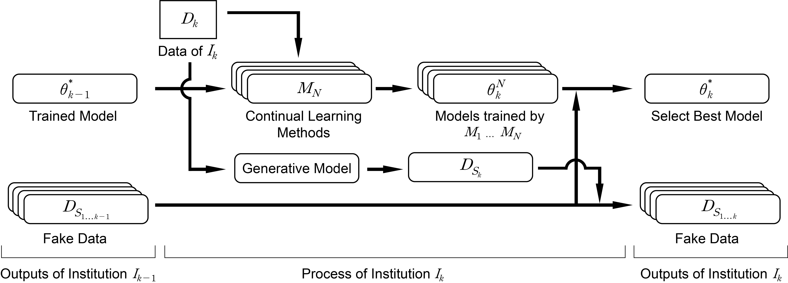

# Continual Learning Framework for a Multicenter Study

<p align="center"></p>

The official source code for Continual Learning Framework for a Multicenter Study paper.

## Overview
Deep learning has been increasingly utilized in the medical field and achieved many goals. Since the size of available data dominates the performance of deep learning, many medical institutions are conducting joint research. However, sharing data is usually prohibited owing to the risk of privacy invasion. Federated learning is a reasonable idea to train distributed data without direct access; however, a central server to merge and distribute models is needed, which is expensive and hardly approved due to various legal regulations. In this paper, we propose a \emph{continual learning framework for a multicenter study}, which does not require a central server and accomplishes the generalized model for a multicenter study by suppressing catastrophic forgetting. We used four independent electrocardiogram datasets for a multicenter study and trained the arrhythmia detection model. We compared our proposed framework to supervised and federated learning methods and finetuning without any regulation to retain preceding knowledge. The proposed framework achieved stable performance for all involved datasets without a central server and access to the past data compared to the others. Furthermore, we first proposed the continual learning method selection algorithm based on a generative adversarial network, which evaluates various continual learning methods prospectively, not ex post facto.
<br/>
<br/>
<p align="center"></p>
<br/>
<br/>

## Requirements
If you use Docker,
- Docker image: ufoym/deepo
Else,
- Python: 3.8.10
- Pytorch: 1.12.0
<br/>
<br/>

## How to Run
- First, construct data for training
```bash
python data_construction.py
```

- Train ECG generator
```bash
python main_GAN_single.py --site [site1-4]
python main_GAN_multiple.py --site [ptb, shaoxing, georgia, cpsc]
```

- Reproduce results
```bash
python main_CL_single.py -m Supervised
python main_CL_multiple.py -m Supervised
python main_CL_single.py -m FedAvg -e 20 -r 30
python main_CL_multiple.py -m FedAvg -e 20 -r 30
python main_CL_single.py -m [Finetuning, Continual] --es 1 --order [stl, lts]
python main_CL_multiple.py -m [Finetuning, Continual] --es 1 --order [stl, lts]
```


